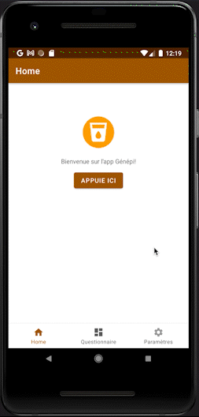

# Genepi
Génépi is our first app in Android developpment, using Kotlin.

This app let you know wich language is better for you !

You can see good practicies in Issues

## NEXT STEPS

Add questions to define your favorite programming language. ✅ DONE

Update the suggested language in real time. ✅ DONE

Show the suggested language in the homepage. ✅ DONE

Being able to change the App logo, the menus colos as you want.

Change the navigation button logo.

## INSTALL

To install the app, please see the following steps : 

*1* - Install Android Studio, and the JDK.

*2* - Clone this project.

*3* - Use your own Android Device, or create a virtual one in Android Studio.

*4* - ENJOY using our works, this app still WIP, you can share with us ideas that you want to be implemented ! 

## Why the project deserves points :

*1* - We created a dynamic application while learning about the wonderful working environment of Android Studio.

*2* - We stored values on the smartphone using SharedPreferences.

*3* - Our application brings happiness and joy, and the questions are intentionally not serious.

*4* - We use multiple views, with a functional navbar.

*5* - We communicate between multiple pages. The homepage displays the latest questionnaire result.

*6* - Our application is intentionally designed to be easily accessible, with uncluttered screens and NO SCROLLING, allowing for a quick understanding of its functionality.

## Developers :

* Nans MAUREL
* Mohamed-ali SEGHAIER

